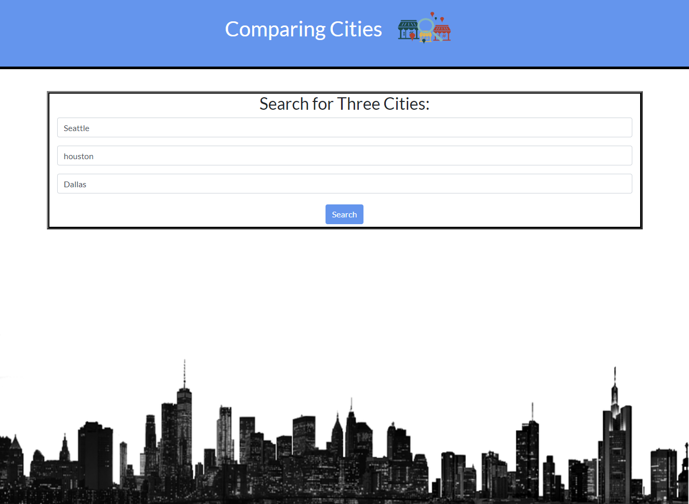

# Comparing Cities

## Description

When you open the website you are presented with a form that gives you the option to input three different cites. When you input three valid cities and click search you are taken to another page. On the second page you are presented three columns with images, information about population, cost of living, and the cities climate. As you scroll down you can see a bar graph for each city that messures out the score of different variables such as housing, heathcare, education, internet access, and more. At the bottom of the page is a button that takes you back to the search page and allows you to repeat the process of comparing different cities. 

## Link 

<a href='https://ivabon.github.io/01-group-project/'>Website Link</a>

## Screenshot 

## Made by

Conor Fortuna, Trey Kockelman, Tristan Hanson, Ivan Bonilla

